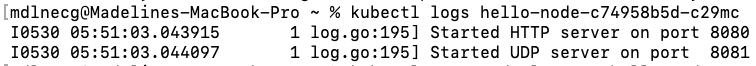
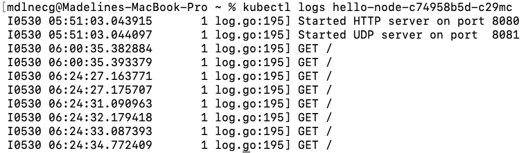

# Tutorial 11 Pemrograman Lanjut: Kubernetes
### Madeline Clairine Gultom - 2306207846 - ADPRO A

> 1. Compare the application logs before and after you exposed it as a Service. Try to open the app several times while the proxy into the Service is running. What do you see in the logs? Does the number of logs increase each time you open the app?

Sebelum aplikasi diexpose:

Pesan yang ditampilkan hanya berupa `Started HTTP server on port 8080` dan `Started UDP server on port  8081` yang  berarti aplikasi berhasil memulai server HTTP di port 8080 dan juga memulai server UDP di port 8081. Namun, tidak terdapat catatan log lainnya mengenai `request` yang masuk.

Sesudah aplikasi diexpose:

Setelah menjalankan perintah `kubectl expose deployment hello-node --type=LoadBalancer --port=8080`, Kubernetes membuat sebuah Service yang membuka akses ke port 8080. Di Minikube, `LoadBalancer` disimulasikan sebagai `NodePort`. Kemudian, menjalankan perintah `minikube service hello-node` akan membuka URL lokal. Setiap kali URL tersebut diakses, aplikasi menerima permintaan `GET /`, dan log akan mencatat setiap request yang masuk. Jumlah log akan terus bertambah sesuai dengan banyaknya permintaan yang diterima.
